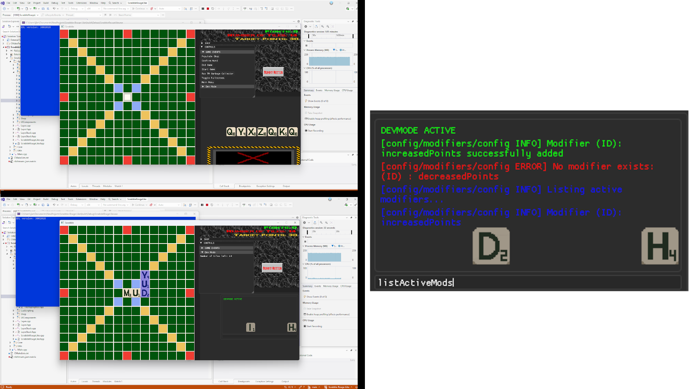

# Scrabble-Rouge-Like

This repo is a scrabble rouge-like game currently in developement.

## Features

* Tile snapping with spellcheck using the Hunspell Library
* Working points system and gameplay flow
* Working Lua scripting and Json config for modifiers that affect points system
* Dev console (with code stollen from my other project [S3DL-3.0](https://github.com/ljlericson/S3DL-3.0))

## How To Build

1. Clone The repo with `git clone https://github.com/ljlericson/SDL2-Template --recurse-submodules`
2. Run `cd vcpkg` and then `./bootstrap-vcpkg.sh` if on Mac/Linux or `./bootstrap-vcpkg.bat` if on Windows

- **IMPORTANT!!** If on Mac, run `brew install pkg-config ninja autoconf automake libtool` or `sudo apt install build-essential pkg-config ninja-build autoconf automake libtool` if on Linux. This installs required libs.

3. Run `./vcpkg install` (this may take a while)
4. Run `cd ..` to go back to the root directory and then run the desired generate shell/batch script (note that on Linux/Mac you must tun like so: `sh <desired generation>.sh`)
5. Run `cd build` and then `make` if on Mac/Linux or simply open the `.sln` file if on Windows (assuming your using VS 2022/2026)